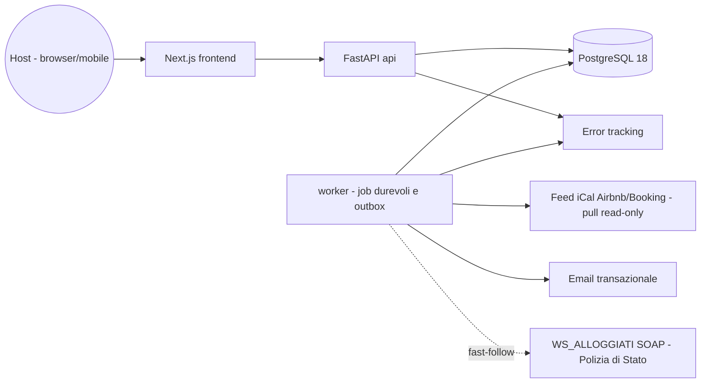
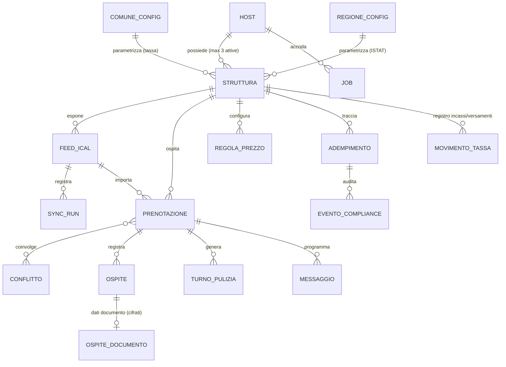

# Architecture Specification: HostPilot

> Architettura dell'MVP pilota: un monolite modulare noioso e affidabile, progettato attorno alle due funzioni di fiducia del prodotto — nessun double-booking sfuggito, nessuna scadenza normativa persa — e con tutto ciò che è normativo trattato come configurazione, mai come codice.

## 0. Scopo e come leggere questo documento

Questo documento è l'artefatto architetturale della **Fase 3 (Solutioning)**, scritto per Fahad (gate **G3**), per John (Epics/Stories e readiness) e per Amelia (Fase 4 — Implementation). Progetta **contro i requisiti reali** del PRD — tutti gli FR e NFR che il PRD elenca — e i flussi UJ della UX Spec, che referenzia per ID senza duplicarli.

Il contratto vincolante per l'implementazione è lo **spine** (`docs/architecture/architecture-HostPilot-2026-07-24/ARCHITECTURE-SPINE.md`): **tutti gli invarianti `AD-n` elencati in `ARCHITECTURE-SPINE.md`**, con regole verificabili — AD-1…AD-20 passati da un reviewer gate a 5 lenti indipendenti (riconciliazione PRD e UX, rubrica, verifica web, attacco avversariale) i cui esiti sono applicati qui; AD-21 registrato il 2026-07-26 come conseguenza architetturale della decisione di Fahad sull'anagrafica Ospite (MYL-40, PRD §14.2), esteso il 2026-07-27 al `sommario` della Prenotazione (MYL-47). Questo documento li spiega, motiva i trade-off e presenta le **decisioni aperte per il G3** (§10). Le scelte di prodotto restano di Fahad: dove c'è un bivio, do opzioni con trade-off e un consiglio, non un verdetto.

Il log decisionale completo (alternative valutate e motivazioni) è in `docs/architecture/architecture-HostPilot-2026-07-24/.memlog.md`.

---

## 1. Architettura di sistema

### 1.1 Forma: monolite modulare + worker (AD-1)

Un solo servizio backend e un worker per i job, stesso codebase, deploy in tre container (frontend, api, worker) su un unico database PostgreSQL.



**Perché un monolite modulare e non microservizi o serverless.** La scala del pilota (decine di host, 1-3 Strutture ciascuno) non giustifica costi operativi distribuiti; il prodotto vive di **job schedulati durevoli** (sync periodico, promemoria, escalation, retention) che si servono meglio con un worker long-running che con funzioni effimere; e un team di agenti che costruisce story indipendenti ha bisogno di **confini espliciti dentro un solo deployable**, non di contratti di rete da versionare. Il rischio classico del monolite — l'accoppiamento strisciante — è neutralizzato dai confini di modulo dello spine (AD-1): comunicazione solo via interfacce di service o eventi persistiti (transactional outbox), mai accesso alle tabelle altrui.

**Moduli** (specchiano i gruppi di feature del PRD §5): `identity` · `strutture` · `calendario` · `prezzi` · `adempimenti` · `operativita` · `notifiche` · `config_normativa` · `privacy`. Il grafo delle dipendenze ammesse è nello spine ed è esso stesso una regola.

### 1.2 Stack (proposta con trade-off — decisione G3-1, §10)

Versioni verificate sul web il 2026-07-24.

| Livello | Scelta | Versione |
| --- | --- | --- |
| Backend | Python + FastAPI + SQLAlchemy 2 + Alembic + Pydantic v2 | Python 3.14, FastAPI ≥ 0.136 |
| Database | PostgreSQL (dati + coda job + outbox + audit) | 18 (uuidv7() nativo) |
| Frontend | Next.js (App Router) + TypeScript | 16.2 LTS (patch ≥ 16.2.11), Node 24 LTS |
| UI (seed, ratifica G3-1) | Tailwind CSS + shadcn/ui; TanStack Query per lo stato server | Tailwind 4.x |
| Worker | Stesso codebase backend, processo dedicato | — |

**Motivazione.** I template di squadra (`frontend-next`, `backend-fastapi` nel repo `test-multica`) sono i candidati indicati dalla costituzione: adottarli è *boring technology* per questo team — meno scelte nuove, più produttività (un principio architetturale, non un ripiego). FastAPI genera OpenAPI nativamente, da cui il client TypeScript tipizzato del frontend (AD-14): il confine frontend/backend resta sincronizzato per costruzione. Postgres da solo copre dati relazionali, coda job, outbox e audit: **zero infrastrutture aggiuntive** (niente Redis/broker) alla scala pilota.

**Alternative valutate.** *Django* (+ admin gratuito, utile per gestire la configurazione normativa; − fuori dai template di squadra, meno naturale per API tipizzate; l'admin si compensa con pochi endpoint interni). *Next.js full-stack* (+ un solo linguaggio; − worker durevoli, SOAP e parsing iCal sono terreno più maturo in Python). *Celery+Redis* per i job (− un'infrastruttura in più senza necessità; la coda in Postgres con `SKIP LOCKED` regge ordini di grandezza oltre il pilota, e l'interfaccia di AD-10 permette di migrare dopo senza ridisegno).

### 1.3 Deployment ed ambienti (AD-15, AD-16; vincoli in §8)

- **Tre container** (frontend, api, worker) + **Postgres gestito**; ambienti `dev` / `staging` / `prod`; migrazioni Alembic forward-only; CI su GitHub Actions (lint, test, build).
- **Regione UE esclusiva** per ogni componente che tocca dati personali (residenza dati GDPR) — vincolo non negoziabile; il provider esatto è deferito alla Fase 4 con vincoli fissati (UE, container, Postgres gestito, backup giornalieri con test di restore).
- TLS ovunque; segreti fuori dal repo (secret manager / env), `.env.example` come contratto.

---

## 2. Modello dati

### 2.1 Nucleo entità (ERD — nomi e relazioni)

I sostantivi del Glossario PRD §4 restano **in italiano verbatim** in codice, DB e API (convenzione dello spine): niente deriva di traduzione tra story indipendenti (`struttura` non diventa mai `property`/`unit`/`listing` a seconda di chi implementa).



Punti che sono **invarianti**, non dettagli:

- **Tenancy** (AD-2): ogni tabella tenant-owned ha `host_id` NOT NULL e ogni query è scopata all'Host autenticato nel layer repository (NFR-14). RLS Postgres come difesa in profondità post-MVP.
- **Semantica temporale unica** (AD-3): una notte è l'intervallo semiaperto `[check_in, check_out)` su date locali Europe/Rome; la sovrapposizione è l'intersezione non vuota di intervalli semiaperti; i timestamp sono UTC; le scadenze normative si calcolano in Europe/Rome. Questa logica vive in un solo punto (`calendario.date_range`) ed è importata da tutti.
- **Soglia dei 3 immobili** (AD-12): il limite di 3 Strutture attive è imposto nel service `strutture` (FR-1); il **Regime fiscale è sempre derivato** da `count(Strutture attive)`, mai persistito come stato autonomo — così contatore e segnalazione non possono divergere (FR-17, UJ-4). La transizione 2→3 / 3→2 emette un evento che attiva/ritira il pannello informativo della UX (sempre con disclaimer: il prodotto segnala, non fa consulenza — Non-Goal PRD §8).
- **Denaro** in centesimi interi (`importo_cent`), mai float — tassa di soggiorno e prezzi non ammettono errori di arrotondamento binario.
- **Stati come literal del Glossario**: `rilevato/gestito/decaduto` (Conflitto — `decaduto` è l'estensione architetturale per la sovrapposizione che cessa da sola, §3.2), `da_fare/in_sospeso/completato/non_applicabile` (Adempimento, con motivazione obbligatoria su `non_applicabile`), `attiva/cancellata/rimossa_dal_feed` (Prenotazione, AD-19), enum Postgres.
- **Un solo modulo scrittore per entità** (AD-18): ogni entità dell'ERD ha un proprietario unico che è l'unico a scriverla; gli altri moduli leggono via service. Elimina alla radice la divergenza "chi possiede l'Ospite" tra import calendario e form Alloggiati.
- **Archiviare, mai distruggere** (AD-20): le Strutture con dati collegati si archiviano (escono dal conteggio Regime fiscale e dal cap attive), non si cancellano; audit compliance, registro tassa e storico sono append-only. Le uniche cancellazioni distruttive sono tre: la purge di retention dei documenti (§7), l'azzeramento dei campi personali alla scadenza della retention di AD-21 — anagrafica `ospite` e `sommario` della Prenotazione (§7): si azzerano i campi, mai si cancella la riga — e la cancellazione GDPR su richiesta.
- **Anagrafica `ospite`** (AD-21 — decisione MYL-40 del 2026-07-26, PRD §14.2): entità tenant-owned (`host_id` NOT NULL, AD-2 — mai un dato di riferimento), scritta solo dal modulo `calendario` (AD-18); `nome`, `email`, `telefono` **tutti nullable**, popolati solo da ciò che il Feed fornisce esplicitamente o che l'Host inserisce volontariamente — mai dedotti dal `sommario` del VEVENT, che resta testo opaco della Prenotazione (e rientra a sua volta nell'azzeramento di retention, alla stessa scadenza — §7, MYL-47); nessun campo documento (quelli vivono solo in `OSPITE_DOCUMENTO`, Epic 3). Ha una retention propria per **azzeramento dei campi** (§7), distinta da quella dei documenti.

### 2.2 Configurazione normativa come dati (AD-9, NFR-4)

`COMUNE_CONFIG` (aliquote, esenzioni, periodicità della tassa di soggiorno) e `REGIONE_CONFIG` (tracciato e periodicità ISTAT/ROSS1000), più i termini Alloggiati Web (24h/6h) e i **parametri fiscali** (soglia della presunzione di imprenditorialità e aliquote citate nel pannello Regime fiscale — AD-12: mai costanti nel codice), vivono in **tabelle versionate con validità temporale** (`valido_dal/al`): un Comune che cambia delibera è un aggiornamento dati, non un rilascio. L'anagrafica base Comuni/Regioni è seedata dai codici ISTAT; gli aggiornamenti di configurazione passano da endpoint interni auditati (chi/cosa/quando), non da modifiche dirette al DB. Comune/Regione non configurati producono lo stato esplicito `configurazione_non_disponibile` con promemoria manuale (FR-2, FR-12, FR-13) — mai un calcolo con default inventati, coerente col degrado sicuro richiesto dal PRD §12.2 e col tono UX ("non ancora configurato per il tuo Comune", non un errore).

---

## 3. Sync iCal e anti double-booking

Il cuore operativo (FR-3…FR-7, NFR-1, NFR-2; UJ-1, UJ-2). Il vincolo di dominio guida tutto: **i Feed iCal sono read-only e non in tempo reale** — l'architettura non finge mai sincronia.

### 3.1 Pipeline di sincronizzazione (AD-4)

Poller pull per Feed, intervallo configurabile (default proposto: 15 minuti, adattivo fino a 5 in prossimità di check-in), eseguito come job durevole (AD-10):

```
fetch (ETag/If-Modified-Since) → parse VEVENT → normalizza → upsert idempotente → rileva Conflitti → notifica
```

- **Idempotenza**: upsert con chiave naturale `(feed_id, ical_uid)` — ogni sync può essere rieseguito senza duplicare né perdere Prenotazioni (NFR-1).
- **Import on-demand al collegamento** (UJ-1): collegare un Feed accoda subito un job di sync prioritario con progresso visibile ("Importazione in corso…" → "Importate N prenotazioni"); URL invalido/irraggiungibile produce errore inline immediato (FR-3). Il poller periodico copre il regime.
- **Append-preserving**: l'import **non cancella mai** una Prenotazione; se un evento scompare dal feed, la Prenotazione passa a `rimossa_dal_feed` (le OTA a volte omettono eventi temporaneamente: cancellare = perdere lo storico e rischiare falsi negativi sui Conflitti).
- **Verità temporale** (NFR-2): ogni run scrive `SYNC_RUN` (esito, timestamp); ogni superficie UI che mostra dati da Feed espone "dati aggiornati alle HH:MM". Un fallimento di sync lascia intatti i dati già importati e produce un errore visibile sulla Struttura (FR-3), con alert interno dopo N fallimenti consecutivi (§8).
- **Uscita di rete** (NFR-17): l'URL del Feed è **input non fidato che il server dereferenzia** — la prima superficie SSRF del prodotto. Il fetch obbedisce alla politica di egress registrata in AD-4: soli schemi `http`/`https`, mai `file`, `gopher`, `ftp`; la destinazione è validata sull'**indirizzo effettivamente risolto** dal DNS — non sulla stringa dell'URL — e rifiutata se ricade su loopback, reti private, link-local o endpoint di metadati d'istanza; la validazione si **ripete dopo ogni redirect**, perché un primo hop legittimo non garantisce il secondo. Timeout di connessione e lettura e cap sulla dimensione della risposta sono **parametri di configurazione**, mai costanti nel codice (stessa disciplina di AD-9). Il rifiuto è un **errore d'uso per l'Host** — lo stesso errore inline dell'URL irraggiungibile (FR-3) — e il messaggio non rivela l'esito della risoluzione: mai un canale di scoperta della rete interna. La politica corrente è una **denylist**; l'allowlist dei domini OTA (più stretta, ma rompe portali minori e channel manager) e un proxy di egress dedicato (costo infrastrutturale) sono alternative note, opzioni aperte di Fahad — registrate nel Deferred dello spine, non debito. *(Hardening accolto dal supervisore su proposta del Test Architect, MYL-39; ratifica formale di Fahad al rientro.)*

### 3.2 Rilevazione e riconciliazione dei Conflitti (AD-5)

- La rilevazione è una **funzione pura** dell'insieme delle Prenotazioni in stato `attiva` di una Struttura (sovrapposizione secondo AD-3, ciclo di vita AD-19), rieseguita dopo ogni import e ogni inserimento manuale (FR-7). Identità stabile del Conflitto = `(struttura_id, coppia di prenotazioni)`: mai due Conflitti aperti per la stessa coppia, mai Conflitti persi (FR-5: "esattamente un Conflitto").
- **Uscita pulita quando il conflitto cessa da solo**: se una delle due Prenotazioni esce dallo stato `attiva` (cancellata sull'OTA, rimossa dal feed), il Conflitto passa a `decaduto` — transizione di sistema tracciata, distinta da `gestito`. Evita rumore permanente in Dashboard e rende **misurabile SM-C1** (i falsi conflitti da lag dei Feed sono esattamente i `decaduto` mai gestiti). `decaduto` estende il Glossario del PRD: da registrare con John (§9.3). La cessazione propaga anche ai derivati: Turni di pulizia e Messaggi futuri della Prenotazione cessata vengono annullati, mai lasciati orfani (AD-19).
- Il Conflitto **espone** fonte e timestamp di sync di ciascuna Prenotazione coinvolta **derivandoli alla lettura** dallo stato corrente, senza colonne-fotografia sulla riga `conflitto` — stessa disciplina per cui l'«ultimo sync riuscito» si deriva dalla traccia append-only dei `SYNC_RUN` invece di essere una colonna del Feed: un Conflitto vive giorni, e un timestamp copiato invecchia continuando a dichiararsi fresco (NFR-2). È esattamente ciò che la Finestra di riconciliazione mostra affiancato (UX UJ-2). *(Allineato a `docs/epics.md` §Story 2.5 e a `docs/prd.md` FR-5 — [DECISIONE ratificata MYL-90, 2026-08-12].)*
- **Risoluzione solo umana**: `rilevato → gestito` avviene esclusivamente per azione esplicita dell'Host, con istruzioni guidate per bloccare le date sull'altro Canale. Il sistema **non scrive mai verso le OTA** e non modifica/cancella mai Prenotazioni autonomamente (FR-6 Out of Scope, Non-Goal §8).
- **Ri-verifica dopo `gestito`** (raccomandazione UX UJ-2 accolta): se la sovrapposizione persiste nei sync successivi oltre una finestra configurabile (default proposto: 24h), si apre un **nuovo** Conflitto collegato al precedente — il sistema non si fida ciecamente della conferma umana, contenendo i falsi negativi (SM-1) senza gonfiare il rumore (SM-C1).
- Un Conflitto `rilevato` resta in evidenza in Dashboard finché non gestito (FR-6); la notifica parte alla prima sincronizzazione in cui emerge (FR-5) via job durevole (mai silenziosa — NFR-3).

---

## 4. Motore di Regole di prezzo

FR-8…FR-10, UJ-5. Vive nel modulo `prezzi`; è un **motore di calcolo consultabile, non un channel manager** (Non-Goal §8: nessun push verso OTA).

- **Valutazione pura e deterministica** (AD-6): il prezzo di una data/Struttura è sempre ricalcolato dalla funzione di valutazione sulle Regole vigenti; nessun prezzo materializzato come fonte di verità (una cache è ammessa solo come derivata invalidabile). Le Regole cambiano → l'anteprima cambia, senza stati incoerenti.
- **Spiegabilità**: ogni prezzo calcolato porta la catena delle Regole applicate ("€145 — Weekend + Alta stagione"), il requisito di trasparenza che la UX pone come indipendente dalla regola di calcolo (UJ-5 edge).
- **Precedenza deterministica, definita in un solo punto**: proposta `last-minute > weekend > stagione > prezzo base`, con il **soggiorno minimo come vincolo ortogonale** (non un livello di prezzo: si applica sempre, qualunque Regola vinca). Chiude la domanda aperta PRD §13.1 — da **ratificare al G3** (decisione G3-2, §10). Anche l'**arrotondamento** è definito una sola volta (half-up al centesimo, nel valutatore): anteprima, export e API mostrano sempre il valore del valutatore, mai un ricalcolo proprio (AD-6, AD-14).
- **Estensibilità**: una Regola è una riga (`tipo`, condizione, valore, priorità implicita dal tipo); un tipo nuovo (es. "ponte/festività") è un'estensione del valutatore, non una migrazione del modello.
- **Export** (FR-10): CSV per data/Struttura (prezzo + soggiorno minimo + regola determinante), il formato che un Host riporta a mano sui portali. Formato esatto da confermare in UX (PRD §13.4).

---

## 5. Adempimenti: motore unico, integrazioni per tipo

Il differenziatore del prodotto (FR-11…FR-16; decisione G1 "MVP in regola"). L'architettura separa **ciò che è uguale per tutti** (stati, scadenze, promemoria, audit) da **ciò che varia per tipo** (trigger, calcolo scadenza, payload, invio).

### 5.1 Macchina a stati unica + plugin per tipo (AD-7)

Tutti e quattro i tipi usano la stessa entità `adempimento` (stati `da_fare / in_sospeso / completato / non_applicabile`, scadenza, Struttura) e lo stesso motore di promemoria/escalation. Ogni tipo implementa il contratto `AdempimentoPlugin`:

| Metodo | Responsabilità |
| --- | --- |
| `trigger` | quando aprire l'Adempimento (es. evento `prenotazione.checkin_registrato` → Alloggiati Web; fine periodo → tassa/ISTAT; Struttura senza CIN → CIN). Il "check-in registrato" è definito una sola volta: l'azione esplicita dell'Host sulla Prenotazione (AD-17) |
| `calcola_scadenza` | dai termini configurati (24h/6h Alloggiati; periodicità Comune/Regione) in Europe/Rome (AD-3) |
| `prepara` | compilazione assistita: payload precompilato dai dati noti |
| `submit` (opzionale) | invio automatico dove esiste un canale ufficiale sostenibile |
| `evidenza` | prova non sensibile dell'esito (timestamp, esito, hash ricevuta) |

Il **Livello di automazione per tipo è configurazione runtime** (FR-16, parametrico su [DECISIONE G2-A]): cambiare livello non tocca il codice né lo storico. Un quinto adempimento futuro è un plugin nuovo, non un ridisegno.

**`completato` solo per conferma esplicita dell'Host o esito di trasmissione registrato** (AD-8): nessun percorso di codice chiude un Adempimento allo scadere del tempo — la counter-metrica SM-C2 ("0 falsi completati") è imposta dall'architettura, non affidata alla disciplina. Un Adempimento scaduto resta evidenziato, mai auto-archiviato (FR-15, UX §4.5).

### 5.2 Cosa è integrabile e cosa è compilazione assistita (per tipo)

| Adempimento | MVP | Invio automatico | Note architetturali |
| --- | --- | --- | --- |
| **Alloggiati Web** (FR-11) | Compilazione assistita: generazione del tracciato ministeriale (txt) + upload guidato sul portale | **Fattibile su canale ufficiale**: web service SOAP **WS_ALLOGGIATI** della Polizia di Stato (attivazione con WSKEY per account) — adapter dietro `submit`, **fast-follow** dopo verifica legale | Il termine 24h/6h decorre dal check-in registrato; countdown in UI (UJ-3). Termini configurabili, non hardcoded (FR-11 NFR) |
| **Tassa di soggiorno** (FR-12) | Calcolo da `COMUNE_CONFIG` + registro incassi/versamenti (`MOVIMENTO_TASSA`) + riepilogo periodico + promemoria | **Non sostenibile nell'MVP**: 1.000+ Comuni con portali/PagoPA eterogenei — nessun canale unico | Il registro modella la responsabilità di versamento dell'host: la Cassazione SS.UU. ord. n. 1527 del 23/01/2026 (host = responsabile d'imposta) è stata **confermata su fonte primaria nel reviewer gate**; il registro prevede anche il riepilogo per la dichiarazione annuale telematica all'Agenzia delle Entrate (Modello 21 abolito) — dettagli da validare col legale (PRD §12.1) |
| **ISTAT/ROSS1000** (FR-13) | Compilazione del prospetto (arrivi, presenze, provenienza) dal tracciato della Regione + promemoria, incluso movimento zero | **Rinviato**: portali regionali non uniformi; eventuali adapter per Regione come plugin post-MVP | Tracciato/periodicità da `REGIONE_CONFIG`; il promemoria "movimento zero" è generato anche senza Prenotazioni nel periodo |
| **CIN** (FR-14) | Tracciamento per Struttura + checklist di esposizione | Non applicabile (la BDSR emette il codice, il prodotto non presenta domande — Non-Goal §8) | CIN assente ⇒ Adempimento `da_fare` in evidenza, mai blocco dell'onboarding (UJ-1) |

Questa ripartizione realizza la raccomandazione G2-A Opz. 2 (promemoria + compilazione assistita per tutti, invio automatico come fast-follow dove sostenibile) **senza pregiudicare** un'eventuale scelta diversa: i livelli sono configurazione.

### 5.3 Scadenze e promemoria: la funzione di fiducia (AD-10, NFR-3)

Ogni azione futura — promemoria con anticipo configurabile (FR-15), escalation a frequenza crescente (UX UJ-3 edge), tick di sync, messaggio automatico, purge di retention — è una **riga nella tabella `job`** (`due_at`, tipo, payload, stato, tentativi, backoff). Il worker fa claim con `SELECT … FOR UPDATE SKIP LOCKED`; consegna at-least-once con handler idempotenti. **Nessun timer solo in-memory è ammesso**: un restart o un crash non può perdere una scadenza — il difetto ad alta severità del PRD (NFR-3) è reso strutturalmente improbabile e osservabile (alert sul ritardo della coda, §8). La gerarchia di urgenza a 3 livelli della UX (§4.6) è calcolata **lato server** in Europe/Rome con soglie configurabili (incluso il livello dedicato < 2h per i soggiorni < 24h, UJ-3 edge) ed esposta come campo `livello_urgenza` dell'API: il frontend la presenta, mai la ricalcola (AD-14). **Canali di notifica all'Host nell'MVP: in-app (Dashboard) + email**, secondo le preferenze di notifica dell'Host (FR-20), che vivono in `identity` e che `notifiche` legge via service (AD-18, freccia `notifiche → identity` del grafo); web push post-MVP dietro la stessa interfaccia `notifiche`.

---

## 6. Operatività: pulizie e messaggi Ospiti

- **Turni di pulizia** (FR-18): un check-out genera/suggerisce un `TURNO_PULIZIA` via evento di dominio dal modulo `calendario` (outbox, AD-1). Visibile all'Host, marcabile completato. L'assegnazione a collaboratori esterni resta fuori MVP (PRD §9.2) e il modello non la preclude (un campo assegnatario in v2).
- **Messaggi automatici** (FR-19, AD-13): job generati dagli eventi del ciclo di vita Prenotazione (pre-arrivo, check-in, check-out), template configurabili per evento/Struttura. **Canale MVP: email.** Risposta architetturale alla domanda aperta PRD §13.2: i Feed iCal spesso **non** forniscono contatti Ospite → il contatto è un campo opzionale inseribile dall'Host; se manca al momento dell'invio, il messaggio diventa un **task visibile "da inviare manualmente"** — mai scartato in silenzio, mai marcato inviato (coerente con il pattern UX "nessuna falsa automazione", §4.3).

---

## 7. Dati sensibili e GDPR

Realizza la policy del PRD §7 (NFR-10…NFR-16) come architettura, non come promessa (AD-11):

- **Segregazione**: i campi del documento d'identità vivono solo in `OSPITE_DOCUMENTO`, limitata ai campi richiesti dal tracciato Alloggiati Web (minimizzazione, NFR-11): il form UX "senza campi extra" (§5.2) è anche il modello dati.
- **Cifratura**: a campo, AES-256-GCM con envelope encryption — DEK per record, KEK nel secret manager, rotazione senza ri-cifratura di massa (NFR-13). TLS in transito ovunque (assunzione PRD confermata).
- **Retention automatica senza buchi**: un job di purge (durevole, AD-10) elimina i dati documento **N giorni dopo `completato`** e in ogni caso **non oltre M giorni dal check-out** anche se l'Adempimento non è mai stato completato — nessun dato sensibile resta in vita indefinitamente per un adempimento abbandonato (NFR-12); la purge non chiude l'Adempimento, che resta aperto senza dati. N e M sono configurazione ([DECISIONE G2-D] — default cautelativi proposti: **N = 30**, **M = 90 giorni**, da confermare col legale prima dell'implementazione compliance). La UI comunica la cancellazione automatica col valore reale del parametro (UX §5.2).
- **Evidenza senza dati**: l'audit dell'avvenuta comunicazione (`EVENTO_COMPLIANCE`, NFR-7) conserva solo prova non sensibile — timestamp, esito, hash della ricevuta — così lo storico sopravvive alla purge dei dati personali (NFR-12 e NFR-7 insieme, senza tensione).
- **Anagrafica Ospite — retention distinta, per azzeramento** (AD-21; decisione MYL-40, PRD §14.2): nome e contatti dell'entità `ospite` (tutti facoltativi) hanno una retention **propria**, separata da quella dei documenti — dato diverso, periodo diverso, base giuridica diversa (i contatti servono a Messaggi e precompilazione, non a un obbligo legale: la qualificazione è nel mandato **R-5 esteso**, materia privacy). Il periodo è un parametro di configurazione legato al ciclo della Prenotazione; la decorrenza è il `check_out`, o l'uscita dallo stato `attiva` se precedente (definita una sola volta, in AD-21); valore iniziale provvisorio proposto 90 giorni, in attesa di R-5. Alla scadenza un job durevole (AD-10) **azzera i campi personali** e marca l'evidenza `anonimizzato_il`: la riga `ospite`, la Prenotazione e la sua storia restano intatte — mai una DELETE di riga (AD-20, coerente con la guardia strutturale GS-6 del test design Epic 2). L'azzeramento copre anche il **`sommario` della Prenotazione** (decisione MYL-47): il `SUMMARY` dei feed OTA contiene spesso il nome dell'Ospite, e azzerare l'anagrafica lasciando in vita il `sommario` vanificherebbe la retention — stessa scadenza, stessa evidenza `anonimizzato_il`; una volta azzerato, un sync successivo non lo ripopola (l'upsert di AD-4 non riscrive il campo di una Prenotazione anonimizzata), e in tutto il resto del suo ciclo di vita il `sommario` resta testo opaco (§2.1), mai promosso ad anagrafica. La cancellazione su richiesta dell'interessato (NFR-15) riusa la stessa procedura di azzeramento, con evidenza.
- **Non-esposizione**: vietato scrivere i campi documento in log, eventi, outbox o risposte API di default; la UI li ri-espone solo per azione esplicita di audit (UX §5.2). Accesso scopato all'Host proprietario (AD-2, NFR-14); cancellazione su richiesta dell'interessato = stessa procedura della purge (NFR-15).
- **Base giuridica** (NFR-10): obbligo legale — nessun uso secondario; nessun dato reale nei fixture/test (NFR-16, project-context §7).

---

## 8. Requisiti non funzionali trasversali

| NFR | Risposta architetturale |
| --- | --- |
| Sicurezza (NFR-6, §7 PRD) | AuthN email+password (argon2id), sessione server-side con cookie HttpOnly Secure SameSite=Lax (AD-15); `host_id` sempre risolto dalla sessione, mai da input client (AD-2); TLS ovunque; segreti in secret manager; MFA post-MVP |
| Affidabilità (NFR-1, NFR-3) | Job durevoli in Postgres, at-least-once + idempotenza (AD-10); sync append-preserving (AD-4); backup giornalieri con test di restore; migrazioni forward-only |
| Osservabilità (NFR-7) | Log strutturati JSON (`request_id`, `host_id`), error tracking centralizzato, metriche + alert su fallimenti sync consecutivi e ritardo coda job; audit compliance append-only (`EVENTO_COMPLIANCE`) (AD-16). I log non contengono mai dati documento. Le metriche di successo del PRD sono misurabili dagli eventi di dominio senza strumentazione separata: SM-1 (Conflitti non `gestito` prima del check-in), SM-2 (`completato` entro scadenza da `evento_compliance`), SM-C1 (Conflitti `decaduto` mai gestiti), SM-C2 (strutturalmente 0 per AD-8) |
| Scalabilità | Dimensionata sul target reale (decine di host nel pilota): single-node con crescita per gradi — indici sui percorsi caldi, poi repliche di lettura, RLS, coda esterna se serve (interfacce già pronte, Deferred dello spine). Nessuna capacità pagata prima che serva |
| Usabilità/A11y/i18n (NFR-5, 8, 9) | Vincoli UX (WCAG 2.1 AA, badge testo+icona, countdown, responsive) imposti al frontend; UI it-IT, formati italiani, fuso Europe/Rome (AD-3). Target misurabili proposti da Sally → decisione con G2-E |
| Configurabilità normativa (NFR-4) | Tabelle versionate con validità temporale, degrado sicuro (AD-9, §2.2) |
| Uscita di rete (NFR-17) | Politica di egress sul fetch dei Feed iCal (AD-4, §3.1): soli `http`/`https`, blocco di loopback/reti private/link-local/metadati d'istanza sull'indirizzo risolto e dopo ogni redirect, timeout e cap di dimensione come configurazione, rifiuto senza divulgazione. Denylist corrente; allowlist OTA e proxy di egress come alternative note (Deferred dello spine) |

---

## 9. Allineamento PRD ↔ UX ↔ Architettura

### 9.1 Copertura

La mappa completa FR/NFR → modulo → invariante è nello spine (*Capability → Architecture Map*). In sintesi: ogni FR elencata nel PRD ha un modulo proprietario e almeno un AD che la governa — inclusa **FR-20** (Account e preferenze di notifica, ratificata al G3 — PRD §5.7): vive in `identity`, con credenziali e sessione sotto AD-15, proprietà di host/sessioni/preferenze sotto AD-18 e superficie API sotto AD-14; le preferenze di notifica sono lette dal motore di notifiche via service (§5.3). Le NFR di fiducia (NFR-1/2/3) sono coperte da invarianti dedicati (AD-4, AD-5, AD-10), non da intenzioni. I punti che il PRD §11 delegava esplicitamente a questa fase sono decisi: meccanismo di sync (AD-4), modello configurabile Comune/Regione (AD-9), cifratura/retention (AD-11), fattibilità dell'invio automatico per Adempimento (§5.2).

### 9.2 Risposte ai punti aperti sollevati da PRD e UX

| Punto aperto | Risposta |
| --- | --- |
| Precedenza Regole di prezzo (PRD §13.1, UX UJ-5) | Proposta in §4, da ratificare al G3 (G3-2) |
| Canale Messaggi + contatti dai Feed (PRD §13.2) | Email MVP; contatto opzionale; fallback "da inviare manualmente" (§6) |
| Ri-verifica del Conflitto dopo `gestito` (UX UJ-2 edge) | Accolta: riapertura su persistenza oltre finestra configurabile (AD-5) |
| Pannello Account/notifiche senza FR (UX §2.3 GAP) | Chiuso al G3: ratificata **FR-20** (PRD §5.7) — vive in `identity` (AD-15, AD-18); preferenze rispettate dal motore di notifiche (§5.3, §9.1) |
| Turni a collaboratori esterni (PRD §13.3) | Fuori MVP; modello non preclusivo (§6) |
| Formato export prezzi (PRD §13.4) | CSV proposto (§4); dettaglio in Fase 4 con Sally |

### 9.3 Gap da riconciliare con John (segnalazione, non decisione)

1. **Esiti delle [DECISIONE G2-A…E] non registrati nel repo**: PRD e UX Spec sono mergiati ma con le decisioni presentate come opzioni e frontmatter ancora `draft`. L'architettura è parametrica e non si blocca, ma gli esiti vanno **registrati per iscritto al più tardi al G3** (idealmente aggiornando i frontmatter di PRD/UX a `approved` nella stessa PR degli esiti).
2. **Piccole estensioni al Glossario PRD** emerse dall'architettura, da registrare: stato Conflitto `decaduto` (sovrapposizione cessata da sola, §3.2), stati Prenotazione `attiva/cancellata/rimossa_dal_feed` (AD-19), archiviazione Struttura (AD-20). Nessuna contraddice il PRD; sono precisazioni che le story useranno.
3. **Billing dell'abbonamento SaaS**: il prodotto è "in abbonamento" ma nessuna FR copre pagamento/gestione abbonamenti. Assumo pilota gestito manualmente (nessun impatto architetturale ora); da decidere post-pilota.
4. **Verifica legale delle fonti normative** (PRD §12.1) e **conferma della retention** (G2-D): prerequisiti della Fase 4 per le feature di compliance, non dell'approvazione dell'architettura — ma vanno pianificati come attività esplicita negli Epics.

---

## 10. Decisioni per il gate G3

Bivi che chiudo con una raccomandazione ma che spettano a Fahad (project-context §2):

- **[G3-1] Stack tecnologico** (§1.2), incluso il seed UI (Tailwind CSS + shadcn/ui + TanStack Query). Raccomando: FastAPI + Postgres + Next.js come da template di squadra. Alternative documentate (Django, Node full-stack) restano praticabili senza cambiare gli invarianti dello spine — la struttura a moduli, la coda durevole e il modello dati sono portabili.
- **[G3-2] Precedenza Regole di prezzo** (§4). Raccomando: `last-minute > weekend > stagione > base`, soggiorno minimo ortogonale. È l'ordinamento più vicino all'intuizione dell'host (l'eccezione più specifica e più vicina alla data vince) e sempre spiegato in UI.
- **[G3-3] Default di retention documenti = 30 giorni dopo `completato`** (§7), come valore iniziale del parametro G2-D **in attesa della conferma legale**. Cautelativo e modificabile senza rilascio.
- **[G3-4] Monorepo applicativo**: codice in questo stesso repo (`backend/` + `frontend/` accanto a `docs/`) — [ASSUNZIONE] da confermare. Semplifica CI e la tracciabilità story→codice del metodo; un repo separato resta possibile senza impatti architetturali.
- **[G3-5] Intervallo di sync di default = 15 minuti** (adattivo fino a 5' vicino ai check-in) e **finestra di ri-verifica Conflitti = 24h** (§3): parametri operativi iniziali, tarabili coi dati del pilota.

Con l'approvazione del G3 va aggiornata (via PR) la sezione §6 *Technology Stack* di `docs/project-context.md` con le versioni esatte, come la costituzione stessa richiede.

---

## 11. Rischi architetturali residui

1. **Qualità/lag dei Feed iCal** (fuori dal nostro controllo): mitigato da append-preserving, verità temporale in UI e ri-verifica post-`gestito` — ma il rischio residuo di double-booking nella finestra di lag esiste per natura del canale (PRD lo riconosce: SM-1 misura i Conflitti non gestiti, SM-C1 il rumore). Non promettere mai sincronia è un vincolo di prodotto, non solo tecnico.
2. **WS_ALLOGGIATI**: canale ufficiale verificato (manuale WS su questure.poliziadistato.it), ma l'attivazione richiede WSKEY per account host e la stabilità del servizio andrà provata in staging prima di promettere l'invio automatico — per questo è fast-follow, non MVP.
3. **Eterogeneità comunale/regionale**: nessuna architettura la elimina; AD-9 la confina a un problema di dati (configurazione) con degrado sicuro. Il costo operativo di popolare le configurazioni è una attività continuativa da pianificare (G2-B).
4. **Fonti normative non primarie** (PRD §12.1): tutto il normativo è parametrico proprio perché una correzione legale deve costare un update di dati, non un rilascio.

---

_Fine Architecture Specification. Approvata al gate umano **G3** (2026-07-24 — frontmatter). Il contratto vincolante per la Fase 4 sono tutti gli invarianti `AD-n` elencati in `docs/architecture/architecture-HostPilot-2026-07-24/ARCHITECTURE-SPINE.md`._
