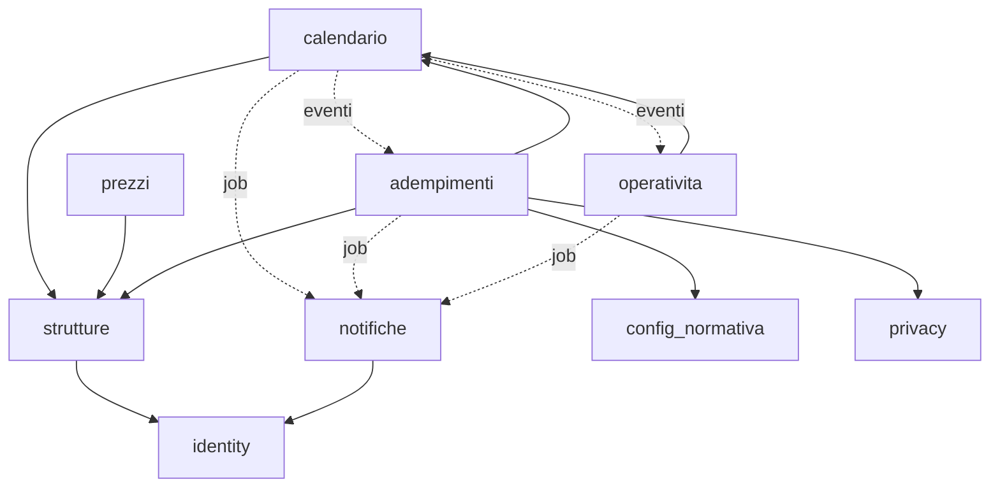
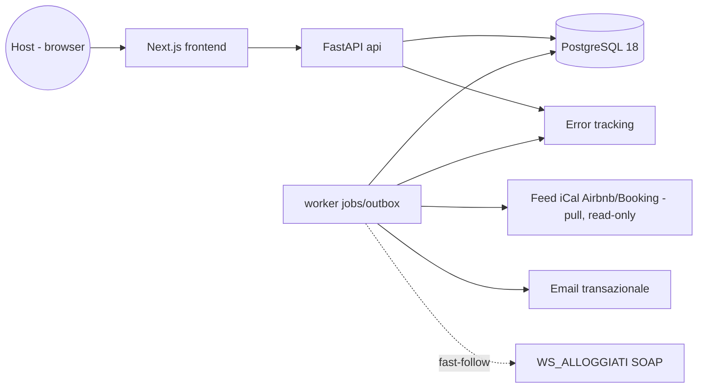
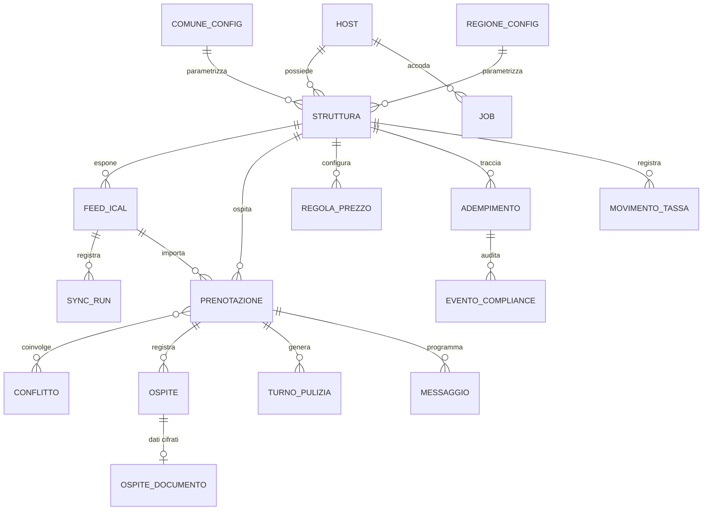

# Architecture Spine — HostPilot

## Design Paradigm

**Monolite modulare a strati con eventi di dominio (transactional outbox).** Un solo deployable backend + un worker, stesso codebase. Ogni dominio è un modulo con strati `api / service / repository`; i moduli comunicano in-process via interfacce di service, gli effetti asincroni passano SOLO da eventi persistiti nella outbox e da job durevoli.

Moduli (= namespace/directory): `identity` · `strutture` · `calendario` · `prezzi` · `adempimenti` · `operativita` · `notifiche` · `config_normativa` · `privacy`.



Le frecce piene sono dipendenze sincrone ammesse (chi può chiamare chi), sempre via interfacce di service: `adempimenti → calendario` è in sola lettura (dati Prenotazione/Ospite per `prepara` e trigger); `notifiche → identity` è in sola lettura (risoluzione destinatario e preferenze). Le tratteggiate sono solo eventi/job asincroni: `calendario -. job .-> notifiche` porta le notifiche di Conflitto (FR-5). Ogni dipendenza non disegnata è vietata. Nessun modulo dipende in modo sincrono da `notifiche`. Il package `core` (shared kernel: `date_range`, catalogo eventi, outbox, jobs, db) non è un modulo di dominio ed è importabile da tutti; non contiene stato di dominio.

## Invariants & Rules

### AD-1 — Monolite modulare, effetti asincroni solo via outbox

- **Binds:** all
- **Prevents:** accoppiamento incrociato tra domini; side-effect persi per crash tra scrittura e notifica.
- **Rule:** un modulo non importa mai `repository` o tabelle di un altro modulo: solo interfacce di service (sincrono) o eventi di dominio (asincrono). Ogni evento è scritto nella tabella `outbox` **nella stessa transazione** della modifica di stato che lo genera; il worker lo consegna dopo il commit.

### AD-2 — Tenancy: scoping per `host_id` obbligatorio

- **Binds:** all (dati)
- **Prevents:** accesso cross-tenant ai dati di un altro Host (NFR-14).
- **Rule:** ogni tabella tenant-owned porta `host_id` NOT NULL; ogni query passa dal repository che impone il filtro `host_id` dell'utente autenticato. Nessuna query di dominio scritta fuori dal layer repository.

### AD-3 — Semantica temporale unica

- **Binds:** calendario, prezzi, adempimenti, operativita
- **Prevents:** due moduli che calcolano sovrapposizioni o scadenze in modo diverso (doppio-booking non rilevato, scadenza sbagliata: SM-1/SM-2).
- **Rule:** una notte di Prenotazione è l'intervallo semiaperto `[check_in, check_out)` su date locali **Europe/Rome**; sovrapposizione ⇔ intersezione non vuota di intervalli semiaperti. Timestamp persistiti in UTC (`timestamptz`); le scadenze normative (24h/6h, periodicità) si calcolano in Europe/Rome. Nessun modulo reimplementa questa logica: vive nello shared kernel `core/date_range` ed è importata da lì.

### AD-4 — Import iCal idempotente, append-preserving

- **Binds:** calendario (FR-3, FR-5, NFR-1, NFR-2, NFR-17)
- **Prevents:** Prenotazioni duplicate o perse tra sync successivi; stato "certo" mostrato su dati stantii; il worker usato come proxy verso la rete interna (SSRF) tramite l'URL di un Feed ostile.
- **Rule:** upsert con chiave naturale `(feed_id, ical_uid)`; l'import non cancella mai una Prenotazione — la scomparsa dal feed marca `stato = rimossa_dal_feed`. Ogni run di sync scrive un record `sync_run` (esito, timestamp) e ogni superficie UI che mostra dati derivati da Feed espone il timestamp dell'ultimo sync riuscito. Il collegamento di un nuovo Feed accoda immediatamente un job di sync prioritario (import on-demand con progresso visibile — UJ-1); il poller periodico copre il regime.
- **Rule (uscita di rete, NFR-17):** l'URL del Feed è input non fidato che il server dereferenzia. Il fetch ammette i soli schemi `http`/`https` — mai `file`, `gopher`, `ftp`; la destinazione è validata sull'**indirizzo effettivamente risolto** dal DNS, non sulla stringa dell'URL, e rifiutata se ricade su loopback, reti private, link-local o endpoint di metadati d'istanza; la validazione si ripete **dopo ogni redirect** (un primo hop legittimo non garantisce il secondo). Timeout di connessione e lettura e cap sulla dimensione della risposta sono parametri di configurazione, mai costanti nel codice (stessa disciplina di AD-9); il superamento chiude la connessione e produce un `sync_run` fallito. Il rifiuto è un errore d'uso per l'Host — lo stesso errore inline dell'URL irraggiungibile (FR-3) — e il messaggio non rivela l'esito della risoluzione: mai un canale di scoperta della rete interna. Politica corrente: **denylist**; l'allowlist dei domini OTA e un proxy di egress dedicato sono alternative note (Deferred), non debito.

### AD-5 — Conflitti: rilevazione pura, risoluzione solo umana

- **Binds:** calendario (FR-5, FR-6, FR-7)
- **Prevents:** auto-risoluzioni che cancellano prenotazioni reali; conflitti duplicati o persi; falsi "gestito".
- **Rule:** la rilevazione è una funzione pura dell'insieme delle Prenotazioni in stato `attiva` di una Struttura (AD-19), rieseguita dopo ogni import e ogni inserimento manuale; l'identità del Conflitto è `(struttura_id, coppia prenotazioni)` — mai due Conflitti aperti per la stessa coppia. Transizioni: `rilevato → gestito` solo per azione esplicita dell'Host; `rilevato/gestito → decaduto` è l'unica transizione di sistema, quando la sovrapposizione cessa (una Prenotazione esce dallo stato `attiva`) — tracciata, mai cancellata (alimenta SM-C1). Se la sovrapposizione persiste nei sync oltre una finestra configurabile dopo `gestito`, si apre un NUOVO Conflitto collegato al precedente. Il sistema non scrive mai verso le OTA e non modifica/cancella mai Prenotazioni autonomamente. (`decaduto` estende il Glossario PRD — da registrare con John, §9.3 del companion.)

### AD-6 — Prezzi: valutazione pura, spiegabile, mai materializzata come verità

- **Binds:** prezzi (FR-8, FR-9, FR-10)
- **Prevents:** prezzi mostrati incoerenti con le Regole vigenti; un numero senza spiegazione (UX UJ-5).
- **Rule:** il prezzo di una data è SEMPRE ricalcolato dalla funzione di valutazione (cache ammessa solo come derivata invalidabile). Ogni risultato porta la catena delle Regole applicate. Precedenza deterministica unica, definita in un solo punto del modulo `prezzi`: `last-minute > weekend > stagione > prezzo base`; il soggiorno minimo è un vincolo ortogonale, non un livello di prezzo. Ogni calcolo percentuale arrotonda al centesimo con regola unica (half-up) definita nel valutatore: export, anteprima e API mostrano SEMPRE il valore del valutatore, mai un ricalcolo proprio. (Precedenza da ratificare al G3 — PRD §13.1.)

### AD-7 — Adempimenti: macchina a stati unica + contratto plugin per tipo

- **Binds:** adempimenti (FR-11…FR-16)
- **Prevents:** quattro implementazioni divergenti di stato/scadenza/notifica; un quinto adempimento futuro che richiede ridisegno.
- **Rule:** tutti i tipi (Alloggiati Web, Tassa di soggiorno, ISTAT/ROSS1000, CIN) usano la stessa entità `adempimento` con stati `da_fare / in_sospeso / completato / non_applicabile` e lo stesso motore di scadenze/promemoria. Ogni tipo implementa il contratto `AdempimentoPlugin`: `trigger` (quando aprire), `calcola_scadenza`, `prepara` (compilazione assistita), `submit` (opzionale), `evidenza`. Il Livello di automazione per tipo è configurazione runtime (G2-A), mai un branch di codice per tipo fuori dal plugin. La transizione a `non_applicabile` richiede una motivazione registrata (UX §4.5).

### AD-8 — `completato` solo per conferma esplicita o esito registrato

- **Binds:** adempimenti (FR-15, FR-16, SM-C2)
- **Prevents:** compliance "ottimistica": adempimenti chiusi senza invio reale (counter-metrica SM-C2 = 0).
- **Rule:** la transizione a `completato` avviene SOLO per (a) conferma esplicita dell'Host o (b) esito di trasmissione positivo registrato dall'adapter di invio. Errore di trasmissione ⇒ resta `in_sospeso` con motivo visibile. Nessun percorso di codice marca `completato` automaticamente allo scadere del tempo.

### AD-9 — Parametri normativi = dati versionati, degrado sicuro

- **Binds:** config_normativa, adempimenti (FR-2, FR-12, FR-13, NFR-4)
- **Prevents:** aliquote/termini hardcoded che richiedono un rilascio per una delibera comunale; importi errati dove manca configurazione.
- **Rule:** aliquote, esenzioni, periodicità, termini (24h/6h) e tracciati vivono in tabelle di configurazione per Comune/Regione con validità temporale (`valido_dal/al`); aggiornarli è un'operazione dati, mai un deploy. Comune/Regione senza configurazione ⇒ stato esplicito `configurazione_non_disponibile` + promemoria manuale — MAI un calcolo con default inventati.

### AD-10 — Scheduling durevole: nessun timer solo in-memory

- **Binds:** notifiche, adempimenti, calendario, operativita (NFR-1, NFR-3)
- **Prevents:** scadenze perse per restart/crash — il difetto ad alta severità del PRD (NFR-3).
- **Rule:** ogni azione futura (promemoria, escalation, tick di sync, messaggio automatico, purge retention) è una riga nella tabella `job` (`due_at`, tipo, payload, stato, tentativi, backoff); il worker fa claim con `SELECT … FOR UPDATE SKIP LOCKED`. Consegna at-least-once ⇒ ogni handler è idempotente. Vietato schedulare con timer di processo non persistiti.

### AD-11 — Dati documento Ospite: segregati, cifrati a campo, retention automatica

- **Binds:** privacy, adempimenti (NFR-6, NFR-10…NFR-16, G2-D)
- **Prevents:** dati identità sparsi per il DB, esposti nei log o conservati per sempre.
- **Rule:** i campi del documento vivono SOLO nella tabella segregata `ospite_documento` (soli campi richiesti dal tracciato Alloggiati), cifrati a campo AES-256-GCM con envelope encryption (DEK per record, KEK nel secret manager). Un job di retention li elimina N giorni dopo `completato` E COMUNQUE non oltre M giorni dal check-out anche se l'Adempimento non è mai stato completato (N, M configurabili — G2-D; la purge non chiude l'Adempimento: resta aperto senza dati sensibili). L'evidenza dell'invio conserva solo prova non sensibile (timestamp, esito, hash ricevuta). Vietato scrivere questi campi in log, eventi, outbox o risposte API di default; la UI li ri-espone solo per azione esplicita di audit. La retention dell'**anagrafica** Ospite (nome/contatti) è un regime DISTINTO — dato diverso, periodo diverso, base giuridica diversa — governato da AD-21: questo AD non la copre e non la sostituisce.

### AD-12 — Regime fiscale: valore derivato, parametri in configurazione

- **Binds:** strutture, config_normativa (FR-1, FR-17)
- **Prevents:** contatore Strutture e regime segnalato che divergono; soglie/aliquote fiscali hardcoded che richiedono un rilascio per una modifica di legge.
- **Rule:** il Regime fiscale si deriva SEMPRE da `count(Strutture non archiviate)` al momento della lettura; la transizione 2→3 / 3→2 emette un evento che attiva/ritira il pannello informativo. La soglia normativa (oggi: 3ª Struttura), le aliquote citate e il testo informativo sono parametri in `config_normativa` (AD-9), MAI costanti nel codice — il cap di prodotto del pilota (max 3 Strutture attive, FR-1) è un parametro distinto dalla soglia fiscale e non va confuso con essa. Il contenuto è informativo con disclaimer, mai un calcolo d'imposta (Non-Goal PRD §8). Entrambi i limiti sono imposti a livello di service `strutture` (unico punto).

### AD-13 — Messaggi Ospiti: event-driven, mai drop silenzioso

- **Binds:** operativita, notifiche (FR-19)
- **Prevents:** messaggi "inviati" mai partiti perché il Feed non fornisce contatti.
- **Rule:** i Messaggi automatici sono job generati dagli eventi del ciclo di vita Prenotazione; canale MVP = email. Se il contatto Ospite manca, il messaggio diventa un task visibile "da inviare manualmente" per l'Host — mai scartato in silenzio, mai marcato inviato.

### AD-14 — Contratto API unico e tipizzato; la logica di dominio resta server-side

- **Binds:** all (confine frontend/backend)
- **Prevents:** frontend e backend che derivano tipi a mano e divergono sulle shape; frontend che ricalcola logica di dominio (urgenze in timezone del browser, prezzi ri-arrotondati) divergendo dal backend.
- **Rule:** REST JSON sotto `/api/v1`, errori RFC 9457 (`application/problem+json`), schema OpenAPI generato da FastAPI; il frontend consuma esclusivamente il client TypeScript generato dallo schema — vietato scrivere fetch tipizzati a mano. I valori derivati di dominio — `livello_urgenza` (normale/urgente/critico, soglie configurabili lato server, calcolo in Europe/Rome), prezzi calcolati con catena di Regole, stati — sono campi della risposta API: il frontend li presenta, MAI li ricalcola.

### AD-15 — AuthN/AuthZ di sessione server-side

- **Binds:** identity, all (accesso)
- **Prevents:** implementazioni auth divergenti per superficie; token client-side con revoca impossibile.
- **Rule:** email+password con argon2id; sessione server-side con cookie HttpOnly Secure SameSite=Lax; ogni endpoint (salvo login/registrazione/health) richiede sessione valida e risolve `host_id` da essa — mai da input client. TLS ovunque.

### AD-16 — Osservabilità e audit di compliance

- **Binds:** all; adempimenti (NFR-7)
- **Prevents:** esiti di compliance non ricostruibili; log che violano la minimizzazione.
- **Rule:** log strutturati JSON con `request_id` e `host_id`; error tracking centralizzato; metriche + alert su fallimenti sync consecutivi e ritardo della coda `job`. Ogni transizione di stato di un Adempimento e ogni trasmissione scrivono un record append-only in `evento_compliance` (chi/cosa/quando/esito). I log non contengono mai campi documento (AD-11). Gli eventi di dominio alimentano la misurazione delle metriche di successo (SM-1, SM-2, SM-C1, SM-C2) senza strumentazione separata.

### AD-17 — Catalogo unico di eventi e job, payload minimi

- **Binds:** all (comunicazione asincrona)
- **Prevents:** produttore e consumatore che assumono payload diversi per lo stesso evento; "check-in registrato" interpretato in modi diversi; tipi di job inventati ad hoc.
- **Rule:** ogni tipo di evento di dominio e di job è dichiarato nel catalogo unico versionato `core/events.py` (nome `<entita>.<fatto_passato>`, schema del payload). Il payload porta SOLO identificatori e il fatto (mai snapshot di stato): il consumatore rilegge lo stato corrente via interfacce di service. Il "check-in registrato" (FR-11, UJ-3) è l'azione esplicita dell'Host sulla Prenotazione nel modulo `calendario`, che emette `prenotazione.checkin_registrato` — è questo evento, e solo questo, il trigger dell'Adempimento Alloggiati Web.

### AD-18 — Un solo modulo scrittore per entità

- **Binds:** all (dati)
- **Prevents:** due moduli che scrivono la stessa entità con shape/regole divergenti (es. `ospite` creato dall'import e riscritto dal form Alloggiati).
- **Rule:** ogni entità dell'ERD ha esattamente un modulo proprietario, l'unico autorizzato a scriverla; tutti gli altri leggono via service. Proprietà: `identity`: host, sessioni, preferenze di notifica · `strutture`: struttura · `calendario`: feed_ical, sync_run, prenotazione, ospite (anagrafica), conflitto · `prezzi`: regola_prezzo · `adempimenti`: adempimento, evento_compliance, movimento_tassa · `config_normativa`: comune_config, regione_config, parametri fiscali · `operativita`: turno_pulizia, messaggio · `privacy`: ospite_documento · `core` (infrastruttura): job, outbox. Il form Alloggiati integra i dati Ospite passando dal service di `calendario` (anagrafica) e da `privacy` (documento), mai con UPDATE diretti.

### AD-19 — Ciclo di vita della Prenotazione e propagazione ai derivati

- **Binds:** calendario, operativita, adempimenti (FR-5, FR-7, FR-18, FR-19)
- **Prevents:** "attiva" interpretato diversamente da rilevazione Conflitti, turni e messaggi; hard delete di Prenotazioni manuali che rompe l'identità dei Conflitti; turni/messaggi orfani di prenotazioni cessate.
- **Rule:** stati della Prenotazione: `attiva / cancellata / rimossa_dal_feed`. Solo `attiva` partecipa alla rilevazione Conflitti (AD-5) e genera derivati (Turni, Messaggi, Adempimenti). Nessuna Prenotazione si cancella fisicamente — quelle manuali si portano a `cancellata`. L'uscita dallo stato `attiva` emette `prenotazione.cessata`, che porta i Conflitti aperti coinvolti a `decaduto` e annulla i Turni di pulizia e i Messaggi futuri derivati (transizioni tracciate, mai delete).

### AD-20 — Archiviare, mai distruggere

- **Binds:** strutture, adempimenti, calendario, core, identity (FR-1, FR-2, NFR-7)
- **Prevents:** un CASCADE conforme a FR-1 ("l'Host può eliminare Strutture") che distrugge audit di compliance, registro tassa e storico versamenti; una lista esaustiva il cui perimetro non è scritto, e che due implementatori leggono in due modi diversi sulla stessa `DELETE` (accaduto sulla PR #47 — la retention della coda `job`).
- **Rule:** una Struttura con dati collegati non si cancella: si porta a `archiviata` (esclusa dal conteggio Regime fiscale e dal cap attive; i Feed smettono di sincronizzare). `evento_compliance`, `movimento_tassa`, gli Adempimenti storici e i `sync_run` sono append-only e sopravvivono all'archiviazione. Il perimetro di questa lista è il **dato di dominio**: le entità dell'ERD, l'evidenza di compliance, la storia del prodotto e il dato personale di cui il prodotto è registro (l'anagrafica `ospite`, `ospite_documento`, il `sommario` della Prenotazione) — ciò che il prodotto rilegge come registro e di cui risponde. Le UNICHE cancellazioni distruttive ammesse sul dato di dominio sono TRE: la purge di retention di `ospite_documento` (AD-11); l'azzeramento dei campi personali alla scadenza della retention di AD-21 — anagrafica `ospite` e `sommario` della Prenotazione: si azzerano i CAMPI, mai si cancella la riga `ospite` né la Prenotazione (l'estensione al `sommario`, decisione MYL-47, è la STESSA cancellazione già ammessa su un campo in più, non una quarta); la cancellazione dati su richiesta GDPR (procedura dedicata, con evidenza). Ogni futura forma di distruzione di dato di dominio deve essere aggiunta esplicitamente a questa lista, o è vietata.
- **Rule (stato operativo del kernel — perimetro chiarito il 2026-07-30, a valle di MYL-51/PR #47):** lo stato operativo è la riga che esiste per far funzionare un MECCANISMO — accodamento, trasporto di eventi, autenticazione, freno anti-abuso — e che nessuna funzione del prodotto rilegge come registro: il suo contenuto o è riderivabile o è già registrato nello stato durevole di dominio. Può contenere incidentalmente dati personali (l'email di un `tentativo_login`, l'`host_id` di una `sessione`): questo non lo promuove a dato di dominio — al contrario, la minimizzazione (NFR-11) spinge la sua retention verso il basso; se un giorno servisse forensica oltre le finestre dichiarate qui, è un'estensione da decidere con l'osservabilità (AD-16), non un default. La cancellazione di stato operativo non è una cancellazione di dato di dominio e non allunga la lista delle tre, ma è ammessa SOLO sulle tabelle nominate in questo elenco — oggi: la coda `job` (MYL-51); `sessione` e `tentativo_login` (meccanismi dell'Epic 1, G-5) — e ha DUE forme, entrambe chiuse su questo elenco. La prima è la **purge**: la retention AUTOMATICA E CICLICA — il job durevole che elimina periodicamente lavoro consumato — ed è ciò che governano le quattro condizioni, tutte necessarie: (1) la riga eliminata non è MAI l'unica evidenza di un fatto di dominio — il fatto vive già in stato durevole di dominio (una tabella append-only come `sync_run`, `azzeramento_audit`, `evento_compliance`, o un marcatore sulla riga interessata come `anonimizzato_il`) prima che la riga sia eliminabile; (2) si elimina solo lavoro CONSUMATO — job `completed`, sessioni scadute, tracce `tentativo_login` oltre la loro finestra di conservazione — mai righe che rappresentano lavoro futuro o in corso; (3) la purge è essa stessa un job durevole (AD-10) e la sua finestra e il suo intervallo derivano SOLO da parametri di configurazione validati all'avvio (disciplina AD-9) — un moltiplicatore fisso nel codice applicato a un parametro è ammesso quando lega la finestra alla semantica di quel parametro (una finestra derivata segue il parametro alla cui semantica è legata: cambia quello, la retention cambia con lui); una costante come unica fonte della finestra no; (4) la purge non tocca MAI le righe `job` in stato `failed`, che ai fini della (2) NON sono lavoro consumato — un fallimento definitivo è un guasto aperto, non un consumo: il loro `last_error` è spesso l'unica traccia residua del guasto e il loro numero è un sintomo che AD-16 misura; si eliminano solo per mano esplicita, quando il guasto che raccontano è chiuso, mai da un ciclo automatico. La seconda forma è l'**operazione di ciclo di vita del meccanismo** — la revoca di una `sessione` da parte del titolare (logout), l'invalidazione delle altre `sessione` attive al cambio password, l'azzeramento del debito del freno all'accesso riuscito: è ammessa in quanto è il meccanismo stesso che lavora, non una retention — le condizioni (2), (3) e (4), scritte per il ciclo automatico, non la riguardano — ma resta vincolata alla (1): mai eliminare l'unica evidenza di un fatto di dominio. Quali fatti di dominio vivano in quelle righe non è una scelta dell'implementatore, e per il freno è DECISO (decisione di Fahad, 2026-07-30 — MYL-65 F5, MYL-66): la traccia dei tentativi falliti è evidenza di un possibile attacco e SOPRAVVIVE all'accesso riuscito — l'operazione di ciclo di vita azzera il DEBITO del freno (il conteggio che il freno oppone ai nuovi tentativi), mai le righe `tentativo_login`: quelle escono solo con la purge ciclica, alla scadenza di una finestra di conservazione PROPRIA — parametro di configurazione DEDICATO, validato all'avvio (disciplina AD-9), a cui l'ammissione della finestra derivata della (3) NON si applica: per `tentativo_login` una finestra ricavata da un parametro d'altra semantica non è una finestra di conservazione — nessun numero in questa regola: la durata è la manopola che il parere privacy di R-5 potrà tarare senza toccare né codice né spine, ed è così che la conservazione convive con la minimizzazione (NFR-11) — non tutto per sempre, ma per una finestra dichiarata e configurabile. Questo elenco è ESAUSTIVO come la lista delle tre: ogni futura tabella che si voglia trattare come stato operativo — gli eventi `outbox` già consegnati (MYL-62) sono il candidato noto, oggi NON in elenco — entra SOLO con un emendamento a questo elenco che registri la verifica delle quattro condizioni, in particolare la (1), o OGNI sua cancellazione — purge o operazione di ciclo di vita — è vietata: una cancellazione in linea non diventa lecita perché non si chiama purge. Una migrazione di schema che non tocca righe (es. `create_index`) non è una cancellazione distruttiva sotto NESSUNA delle due regole.

### AD-21 — Anagrafica Ospite: minimizzazione, retention per azzeramento dei campi

- **Binds:** calendario (FR-4, FR-19, NFR-10, NFR-11, NFR-12, NFR-14, NFR-15; decisione MYL-40 — PRD §14.2). _Registrato il 2026-07-26, dopo il gate G3, come conseguenza architetturale della decisione di Fahad su MYL-40; esteso al `sommario` della Prenotazione il 2026-07-27 (decisione di Fahad su MYL-47)._
- **Prevents:** contatti Ospite trattati senza base giuridica qualificata; nomi "dedotti" dal testo opaco dei Feed; dati personali dell'anagrafica conservati per sempre; il nome dell'Ospite che sopravvive alla retention dentro il `SUMMARY` importato dal Feed; una retention implementata come DELETE che rompe lo storico delle Prenotazioni, l'identità dei Conflitti (AD-5) e l'append-preserving (AD-4, AD-20).
- **Rule:** `ospite` (anagrafica: `nome`, `email`, `telefono` — TUTTI nullable, mai obbligatori) è tenant-owned — `host_id` NOT NULL sotto la guardia strutturale AD-2, mai nell'allowlist dei dati di riferimento — e la scrive solo `calendario` (AD-18). Si persiste SOLO ciò che il Feed fornisce esplicitamente o che l'Host inserisce volontariamente: nessun campo dedotto o inferito — il `sommario` del VEVENT resta testo opaco della Prenotazione, mai promosso a nome — e nessun campo documento (quelli vivono solo in `ospite_documento`, AD-11). La retention è un parametro di configurazione legato al ciclo della Prenotazione (mai una costante nel codice — stessa disciplina di AD-9; valore iniziale provvisorio in attesa di R-5, proposta nel Deferred): la decorrenza è il `check_out`, o l'uscita dallo stato `attiva` (AD-19) se precedente — definita QUI e in nessun altro punto. Alla scadenza un job durevole (AD-10, handler idempotente) **azzera i campi personali** e ne marca l'evidenza **`anonimizzato_il`** — ciò che distingue una riga azzerata da una che non ha mai avuto il dato: la riga `ospite`, la Prenotazione e la sua storia restano intatte — l'azzeramento non è MAI una cancellazione di riga (AD-20). L'azzeramento copre anche il **`sommario` della Prenotazione** (decisione MYL-47): il `SUMMARY` dei feed OTA contiene spesso il nome dell'Ospite, e azzerare l'anagrafica lasciandolo in vita vanificherebbe la retention — stessa decorrenza, stessa evidenza `anonimizzato_il` (marcata sulla riga il cui campo è stato azzerato: per il `sommario`, la Prenotazione), stessa natura: un campo in più della STESSA cancellazione ammessa da AD-20, non una quarta. Una volta azzerato, un campo non è ripopolabile da un sync successivo: l'upsert di AD-4 NON riscrive il `sommario` di una Prenotazione anonimizzata — la stessa disciplina con cui non riscrive una decorrenza già maturata. In tutto il RESTO del suo ciclo di vita il `sommario` resta testo opaco della Prenotazione: trattarlo come dato personale alla scadenza non lo promuove ad anagrafica. La cancellazione su richiesta GDPR (NFR-15) riusa la stessa procedura di azzeramento, con evidenza. I dati dell'anagrafica non compaiono in log, eventi, payload `outbox`/`job` o notifiche (soli identificatori — AD-16, AD-17); ogni altro modulo li legge solo via service di `calendario`.

## Consistency Conventions

| Concern | Convention |
| --- | --- |
| Naming di dominio | I sostantivi del Glossario PRD §4 restano in italiano VERBATIM in codice, DB e API: `struttura`, `prenotazione`, `conflitto`, `adempimento`, `regola_prezzo`, `turno_pulizia`, `ospite`… Vocabolario tecnico in inglese (`service`, `repository`, `job`, `outbox`). |
| Naming file/DB/API | DB e JSON: `snake_case`; classi Python: `PascalCase`; endpoint: `/api/v1/<risorsa-plurale>`; eventi di dominio: `<entita>.<fatto_passato>` (es. `prenotazione.importata`, `conflitto.rilevato`). |
| Identificatori | PK `UUIDv7`; chiavi naturali esterne (es. `ical_uid`) mai usate come PK. |
| Date e denaro | Date di calendario: `DATE` locale Europe/Rome; istanti: `timestamptz` UTC; importi: interi in centesimi di euro (`_cent`), mai float. |
| Stati | Le stringhe di stato usano i literal del Glossario: `rilevato/gestito`; `da_fare/in_sospeso/completato/non_applicabile`; persistiti come enum Postgres. |
| Errori | RFC 9457 problem+json con `type` stabile per errore di dominio; mai stacktrace al client. |
| Mutazioni di stato | Solo nei service del modulo proprietario, in transazione, con evento outbox quando altri moduli devono reagire. |
| Config runtime | 12-factor: env vars per infrastruttura, tabelle `config_normativa` per parametri normativi (aggiornate via endpoint interni auditati, seeding anagrafica Comuni/Regioni da codici ISTAT); soglie di urgenza e finestre operative in tabella di configurazione applicativa; segreti mai nel repo (`.env.example`). |
| Frontend: dati | Solo client TypeScript generato (AD-14) + TanStack Query per lo stato server; nessuno store globale aggiuntivo senza motivazione registrata. Componenti server-first (App Router); stato client solo per interazione locale. |
| Frontend: copy | Tutte le stringhe it-IT vivono in moduli copy per feature (nessuna stringa di dominio hardcoded nei componenti); i termini del Glossario verbatim anche nella UI. |
| Test | Test-first (Amelia); nessun dato reale di Ospiti nei fixture (project-context §7); la semantica di AD-3, la precedenza/arrotondamento AD-6 e le transizioni AD-19 hanno test dedicati condivisi. |

## Stack

Verificato corrente sul web il 2026-07-24 (doppio check nel reviewer gate).

| Name | Version |
| --- | --- |
| Python | 3.14 |
| FastAPI | ≥ 0.136 (corrente 0.139.x) |
| SQLAlchemy | 2.x |
| Alembic | 1.18+ |
| Pydantic | v2 (≥ 2.12) |
| PostgreSQL | 18 (uuidv7() nativo) |
| Next.js (App Router, TypeScript) | 16.2 LTS (patch ≥ 16.2.11) |
| Node.js | 24 LTS |
| Tailwind CSS + shadcn/ui (seed UI, ratifica G3-1) | Tailwind 4.x |
| TanStack Query | 5.x |

## Structural Seed

Vista di sistema (contesto + container):



ERD del nucleo (nomi e relazioni; gli attributi-invariante sono negli AD):



Albero sorgente proposto (scaffolding in Fase 4, dopo G3 — [ASSUNZIONE] app nello stesso repo):

```text
hostpilot/
  backend/
    app/
      identity/ strutture/ calendario/ prezzi/
      adempimenti/          # plugins/: alloggiati_web.py, tassa_soggiorno.py, istat_ross1000.py, cin.py
      operativita/ notifiche/ config_normativa/ privacy/
      core/                 # date_range, events.py (catalogo AD-17), outbox, jobs, db, config
    alembic/
    tests/
  frontend/
    app/                    # dashboard, calendario, prezzi, adempimenti, operativita, strutture, onboarding
    lib/api/                # client generato da OpenAPI
    lib/copy/               # stringhe it-IT per feature
  docs/
```

Envelope operativo (vincolante quanto gli AD):

- Ambienti `dev` / `staging` / `prod`; regione UE esclusiva per ogni componente che tocca dati personali.
- CI su GitHub Actions: lint, typecheck, test, build su ogni PR; nessun merge con CI rossa (gate GitHub, non criterio di consegna agente).
- Migrazioni Alembic forward-only, eseguite prima del deploy dell'app.
- Backup giornalieri del DB con test di restore periodico; RPO 24h, RTO 4h come target di pilota.
- Segreti solo nel secret manager dell'ambiente; `.env.example` come contratto; canali di notifica Host nell'MVP: in-app + email.

## Capability → Architecture Map

| Capability / Area | Lives in | Governed by |
| --- | --- | --- |
| FR-1, FR-2 (Strutture, Comune/Regione, cap 3) | strutture | AD-2, AD-9, AD-12, AD-20 |
| FR-3 (import iCal) | calendario | AD-4, AD-10, AD-19 |
| FR-4 (calendario unificato) | calendario + frontend | AD-3, AD-4, AD-14, AD-21 |
| FR-5, FR-6, FR-7 (Conflitti e riconciliazione) | calendario | AD-3, AD-5, AD-19 |
| FR-8, FR-9, FR-10 (Regole di prezzo) | prezzi | AD-6 |
| FR-11 (Alloggiati Web) | adempimenti/plugins + privacy | AD-7, AD-8, AD-11, AD-17 |
| FR-12 (Tassa di soggiorno) | adempimenti/plugins + config_normativa | AD-7, AD-9 |
| FR-13 (ISTAT/ROSS1000) | adempimenti/plugins + config_normativa | AD-7, AD-9 |
| FR-14 (CIN) | adempimenti/plugins | AD-7 |
| FR-15, FR-16 (cruscotto, automazione) | adempimenti + notifiche | AD-7, AD-8, AD-10 |
| FR-17 (Regime fiscale) | strutture | AD-12 |
| FR-18 (Turni di pulizia) | operativita | AD-1, AD-10, AD-19 |
| FR-19 (Messaggi automatici) | operativita + notifiche | AD-13, AD-10, AD-19, AD-21 |
| FR-20 (Account e preferenze di notifica) | identity | AD-15, AD-18, AD-14 |
| NFR-1…NFR-3 (sync, verità temporale, notifiche) | calendario + notifiche | AD-4, AD-5, AD-10 |
| NFR-17 (uscita di rete sul fetch dei Feed) | calendario (worker) | AD-4 |
| NFR-4 (configurabilità normativa) | config_normativa | AD-9 |
| NFR-6, NFR-10…16 (GDPR) | privacy + calendario (anagrafica `ospite`) | AD-11, AD-21, AD-15, AD-16 |
| NFR-7 (osservabilità compliance) | adempimenti | AD-16 |
| NFR-5, NFR-8, NFR-9 (usabilità, a11y, i18n) | frontend | UX Spec §1, §6 (vincoli), AD-14 |

## Deferred

- **Provider di hosting esatto** — vincoli fissati (UE, container, Postgres gestito, backup); la scelta commerciale non blocca il design e spetta alla Fase 4 con Fahad.
- **Provider email transazionale** — vincolo: DPA GDPR, preferenza invio da UE; scelta in Fase 4.
- **Web push / canali di notifica aggiuntivi per l'Host** — MVP: in-app + email (envelope operativo); web push post-MVP dietro la stessa interfaccia `notifiche`.
- **Tool di product analytics (SM-3/SM-4/SM-5)** — la misurazione delle SM operative (SM-1/2/C1/C2) è già alimentata dagli eventi di dominio (AD-16); un eventuale tool esterno di analytics è scelta post-MVP.
- **Adapter SOAP WS_ALLOGGIATI (invio automatico)** — fast-follow dietro `AdempimentoPlugin.submit` (AD-7); l'MVP parte in compilazione assistita. Richiede WSKEY per Host e verifica legale preventiva.
- **Set iniziale Comuni/Regioni configurati (G2-B)** — decisione di prodotto; l'architettura degrada in sicurezza (AD-9) qualunque sia il set.
- **Retention esatta documenti (G2-D)** — parametro di configurazione (AD-11); default cautelativo proposto 30 giorni, da confermare col legale.
- **Valore della retention dell'anagrafica `ospite`** — parametro di configurazione (AD-21), decorrenza definita nell'AD; valore iniziale provvisorio proposto **90 giorni** (stesso ordine del bound M di G2-D: cautelativo, modificabile senza rilascio; trade-off: lo storico calendario perde i nomi dopo la scadenza — un periodo più lungo è possibile solo se R-5 qualifica la base giuridica dei contatti). Conferma nel mandato R-5 esteso (materia privacy — PRD §14.2), come G2-D.
- **RLS Postgres** — difesa in profondità complementare ad AD-2, attivabile post-MVP senza cambiare il modello.
- **Allowlist domini OTA / proxy di egress dedicato (NFR-17)** — alternative alla denylist corrente per l'uscita di rete del fetch Feed (AD-4): l'allowlist è più stretta ma rompe i portali minori e i channel manager; il proxy di egress costa infrastruttura. Opzioni aperte di Fahad, registrate come alternative note — non debito tecnico.
- **Billing dell'abbonamento SaaS** — nessuna FR nel PRD; pilota gestito manualmente; da progettare post-pilota.
- **MFA, SSO** — post-MVP; AD-15 non li preclude.
- **Push prezzi/disponibilità verso OTA** — Non-Goal PRD §8; riconsiderabile solo con API OTA di scrittura ufficiali.
- **Coda esterna (Redis/Celery)** — solo se il volume job supera la scala pilota; stessa interfaccia di AD-10.
